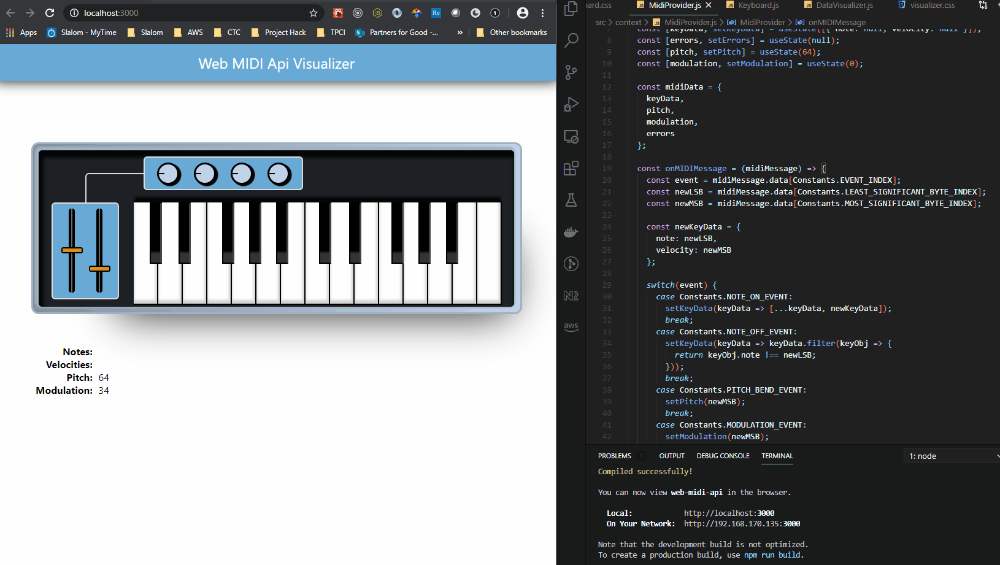

## Web MIDI Api Visualizer

This React app uses the experimental [Web MIDI Api](https://webaudio.github.io/web-midi-api/) to visualize data received from a connected MIDI device. 

MIDI messages sent from a connected device are ingested using the api, and passed to components using React's Context api.

This is meant to be a generic set-up that can be used to create other components to visualize the incoming MIDI data. As an example, I've created a Keyboard component, which was designed specifically for a 25 key MIDI controller I have.

To make your own components that utilize this generic setup, clone this repo and create a new React functional component. Add the following to your new component to receive MIDI data from your connected device:
1. First `import { useContext } from 'react';`.
2. Import the MIDI context: `import MidiDataContext from '../context/MidiDataContext';`
3. Within your functional component, add `const { keyData, pitch, modulation, errors } = useContext(MidiDataContext);`. This will read the incoming note on/off events and save them to keyData, provide pitch and modulation values, and an error if your device disconnects.

